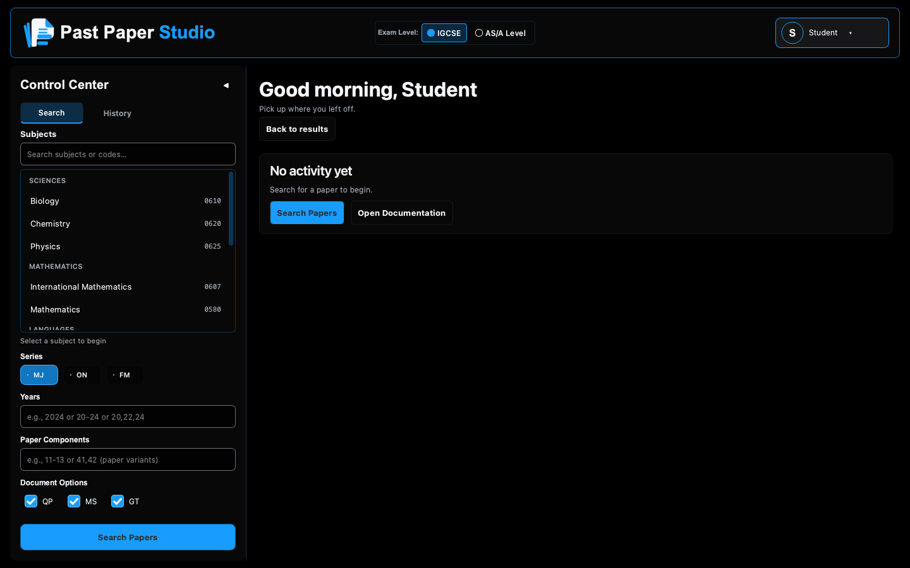
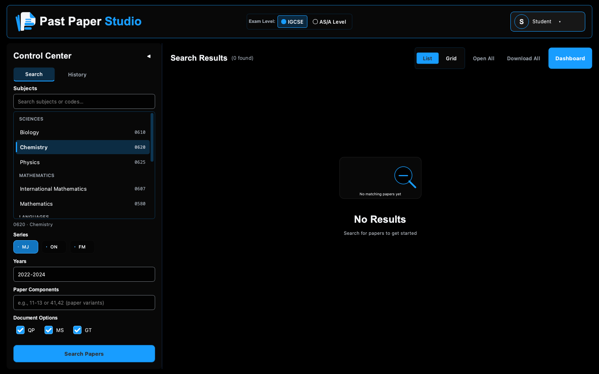
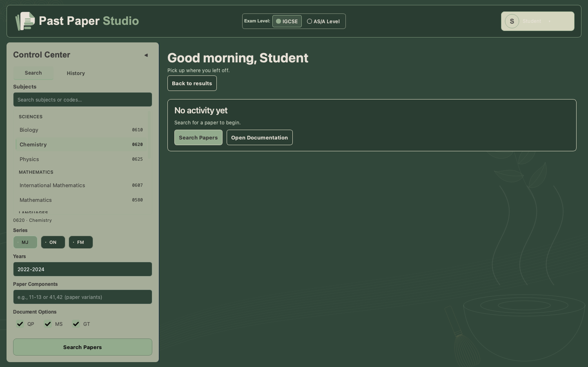
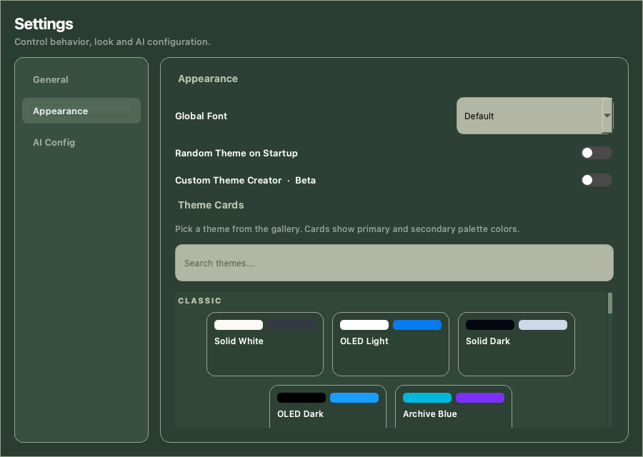

# Past Paper Studio
A free, open-source desktop app for finding, practicing, and managing Cambridge past papers — featuring Exam Mode, AI-assisted grading, progress tracking, themes, and more. Built for students, by a student.

**A note on development:** I built Past Paper Studio with significant help from AI coding tools, mainly for implementation, debugging, testing, and packaging. The project itself has been something I've actively designed and developed over time — from the features and UI/UX to testing, iteration, and overall direction. I'm still learning programming, and using AI has helped me turn those ideas into something I can actually ship.

## Download Beta 1.0

Download the `.dmg` from [GitHub Releases](https://github.com/IronPlayz1234/past-paper-studio/releases), open it, and drag **Past Paper Studio** into **Applications**.

The current packaged build supports **Apple Silicon Macs running macOS 26 or later**. It does not support Intel Macs or Windows. Python does not need to be installed to use the Mac app.

**Unsigned-distribution notice:** this beta is locally ad-hoc signed and is not Apple Developer ID signed or notarized. macOS may block a downloaded copy. If you trust this project and have verified the download, follow Apple's guidance for opening apps from an unidentified developer: https://support.apple.com/guide/mac-help/open-a-mac-app-from-an-unidentified-developer-mh40616/mac. Do not disable Gatekeeper system-wide.

A `.sha256` file accompanies the installer. Verify the checksum from the directory containing both files:

```sh
shasum -a 256 -c 'Past.Paper.Studio.Beta.1.0-arm64.dmg.sha256'
```

## Features

- Search compatible examination materials from third-party archives.
- Practice with Exam Mode, a PDF viewer, answer workspace and drawing tools.
- View study activity and saved attempts in the Dashboard.
- Personalize profiles, static themes, fonts and interface language.
- Optional AI-assisted evaluation with your own configured credentials.

AI evaluation is a study aid; check feedback against the official mark scheme. Interface translations do not translate examination documents. Network services and OCR model downloads may require internet access.

## Screenshots

Captured from Beta 1.0 with a fresh demo profile.

### Dashboard

The home screen before any study activity has been saved, using the OLED Dark theme.



### Paper search

Choose a subject, series, years, paper components and document types. This view shows the search controls before results are loaded.



### Matcha Latte theme

The same workspace with the Matcha Latte theme applied.



### Appearance settings

Browse themes and personalize the interface font.



## Run from source

The packaged macOS build uses Python 3.11. To reproduce its dependency environment on an Apple Silicon Mac:

```sh
python3.11 -m venv .venv
source .venv/bin/activate
python -m pip install -r packaging/macos-requirements.lock
python Core/gui_main.py
```

The build lock targets the macOS build environment; it is not a cross-platform dependency lock. See [MACOS_BUILD.md](MACOS_BUILD.md) for packaging instructions. The `Tests` directory contains pytest checks; pytest is a separate development dependency.

## Privacy and local data

Configuration, API keys, profile images, saved answers and caches belong in external user data storage and are excluded from this repository and installer. Some storage names retain `PastPaperFinder` for compatibility. Never commit your credentials or personal study records. AI requests send relevant evaluation inputs to your configured provider; external archive requests go to the selected sources.

## License and sourcing

Past Paper Studio's project code is licensed under [GNU GPLv3](LICENSE). Bundled third-party dependencies retain their own licenses; the Mac application includes dependency notices under `Contents/Resources/ThirdPartyLicenses`. A copy of LGPLv3 is retained in `LICENSES` for relevant third-party licensing; it does not replace the project's GPLv3 license.

Past Paper Studio is independent and is not affiliated with or endorsed by Cambridge University Press & Assessment or Cambridge International Education. Examination documents and third-party names remain the property of their respective rights holders. Materials are retrieved from independent archives, including PapaCambridge, PastPapers.co and BestExamHelp. Users are responsible for following the rights holders' and sources' terms.
